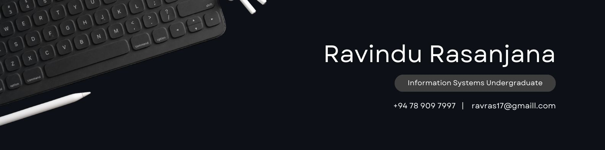

<!-- Profile README for Ravindu-Rasanjana -->

  
  <h1>Hi, I'm Ravindu Rasanjana 👋</h1>
  

    <b>Information Systems Undergraduate</b> 
    <a href="https://ucsc.cmb.ac.lk/">University of Colombo School of Computing</a>
  

---

## 🧑‍💻 About Me

I’m an enthusiastic Information Systems undergraduate at UCSC, passionate about building web applications and exploring the world of electronics and IoT. I enjoy transforming ideas into reality through code and design.

---

## ⚡ Skills & Tools

  
  
  
  
  
  
  

---

## 🚀 Interests

- Web & Mobile App Development
- Designing UI/UX in Figma
- IoT & Electronic Projects
- Learning new technologies

---

## 📂 Featured Projects

<!-- Add your favorite projects below with short descriptions or links -->
- **Smart Home Automation System** – IoT project connecting sensors and devices.
- **Personal Portfolio Website** – Built with HTML, CSS, JS, and Figma designs.
- **Java/Kotlin Mini Apps** – Various small applications for coursework and fun.

---

## 📫 Contact Me

Feel free to reach out if you want to collaborate or just say hi!

- Email: [your.email@domain.com](mailto:your.email@domain.com)
- [LinkedIn](#) <!-- Add your LinkedIn URL if you want -->
- [Personal Website](#) <!-- Add your website URL if you want -->

---

  

<!--
  You can enhance this README with GitHub stats, activity graphs, or more graphics!
-->
